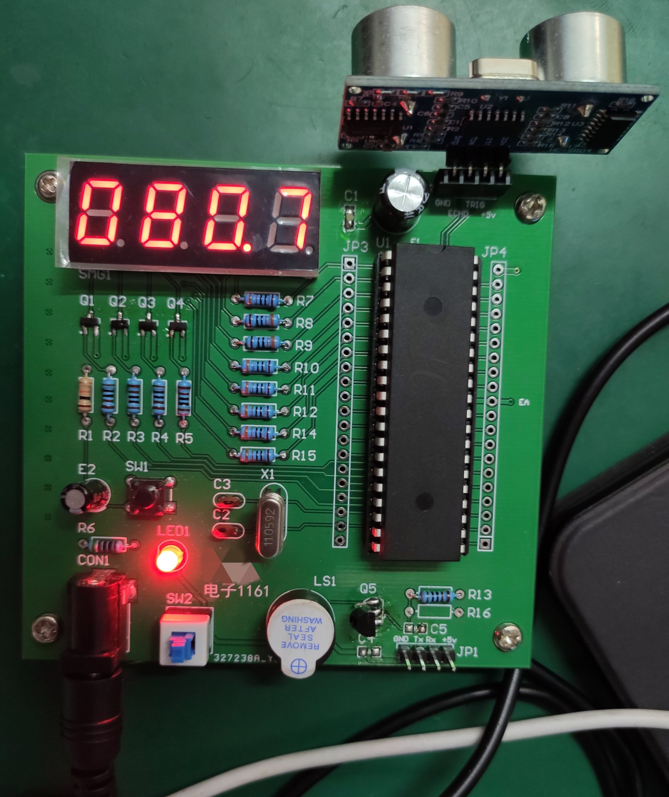

# 超声波测距

本项目为课程实习，这里将项目源代码、PCB 都开源出来



## 任务目标

利用51单片机、按键、超声测距模块、7段数码管、蜂鸣器设计一个超声波测距雷达，可以测量并用数码管显示距离，测量精度应小于2厘米。还应具备声音提醒功能，即当所测距离小于0.8米时，蜂鸣器应滴滴鸣响，并随着距离的减小，滴滴声越来越急促，至0.3米内时蜂鸣器应长鸣。

## 目录结构

```
├─hardware          硬件资料
├─hex               生成固件
├─src               源代码
├─makefile          为 sdcc 保留
└─ultrasonic.uvproj keil 工程
```

## 改进方向

+ PCB 增加 LED 用以调试和显示系统状态
+ PCB 的7位数码管的封装里，两排管脚间距有点小了，安装数码管会不方便
+ 增多报警急促等级，现在只有5级
